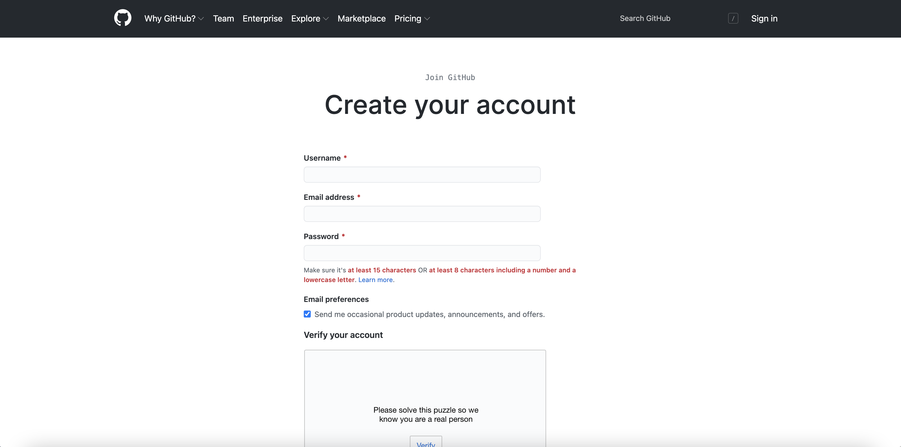
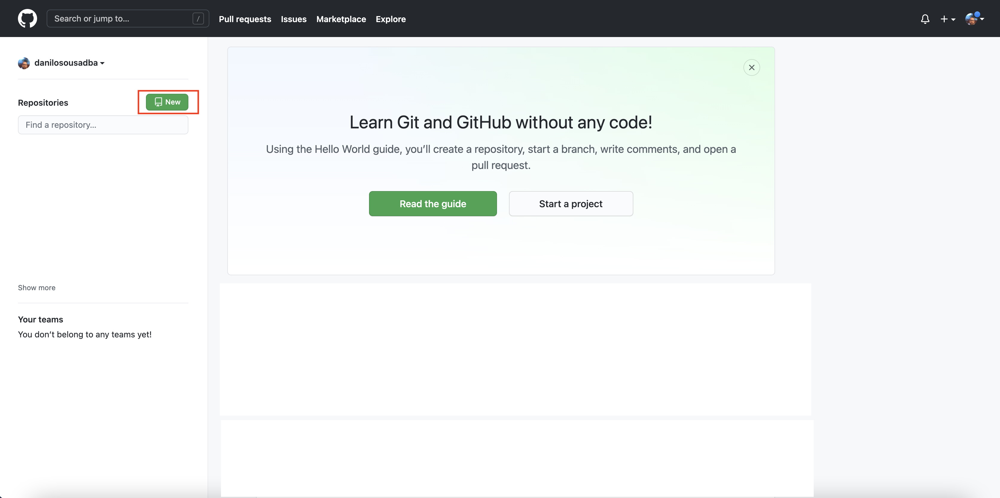
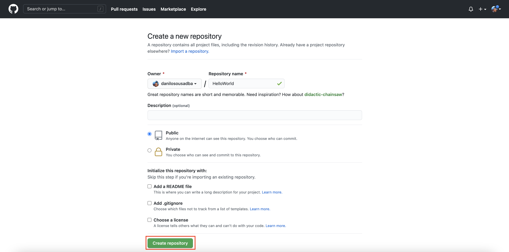
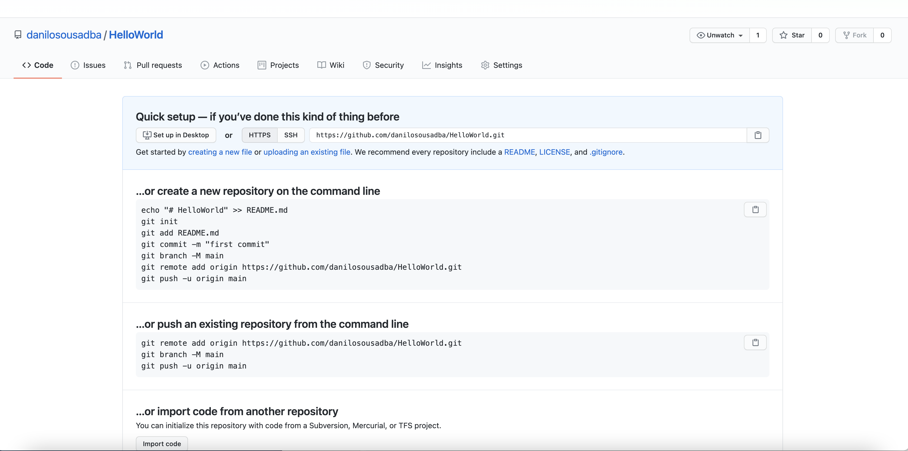
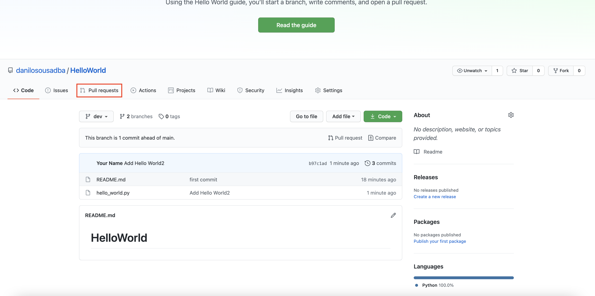
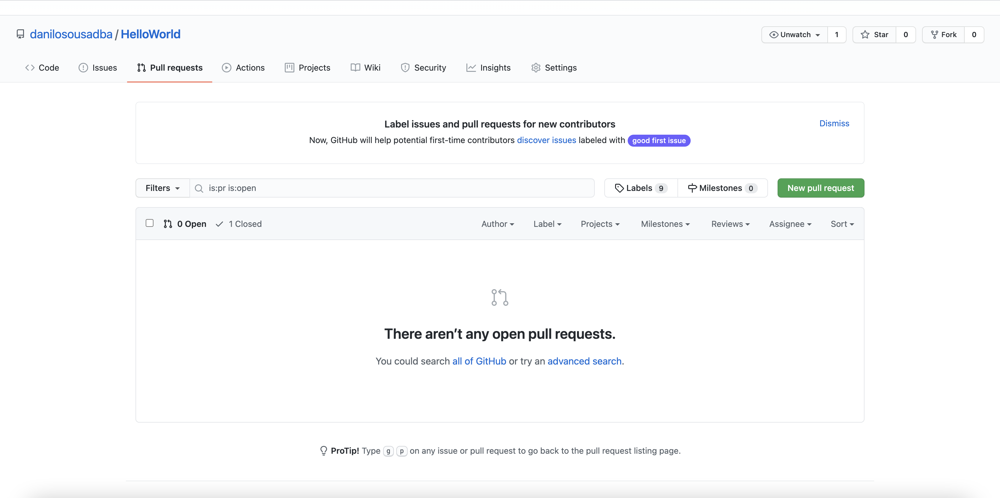
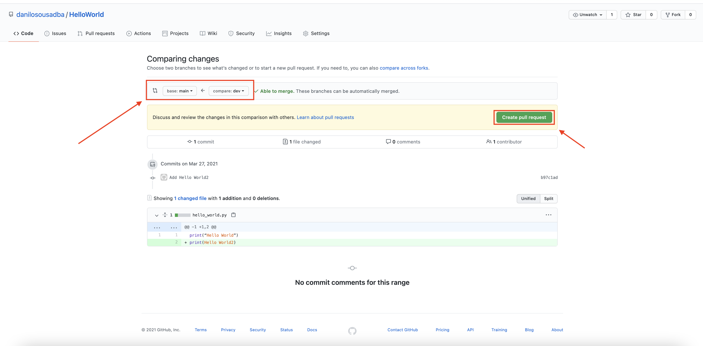
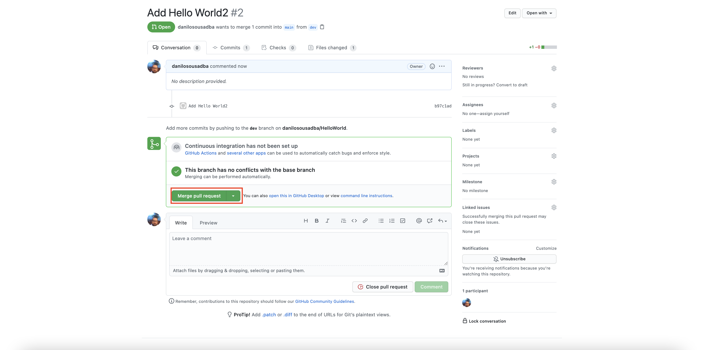

# DataOps Exercicío 01

## Objetivo
Introduzir aos alunos a ferramenta github possibiliando a criação de um usuário, repositório e comecar a entender o ciclo de versionamento de códigos

## Pré Requisitos

- git - https://git-scm.com/download/
- - Mac https://git-scm.com/download/mac
- - Linux https://git-scm.com/download/linux
- - Windows https://git-scm.com/download/win

## Criando Login no GitHub

- Criar um usuário no github.com -  https://github.com/




Criando seu repositorio








Execute os comandos abaixo para criar os arquivos no repositório criado

```
mkdir HelloWorld
cd HelloWorld
echo "# HelloWorld" >> README.md
git config --global user.email "you@example.com"
git config --global user.name "Your Name"
git init
git add README.mdls
git commit -m "first commit"
git branch -M main
```
Altere o __$USUARIOGITHUB__ pelo seu login ou então copie a URL do PROJETO

```
git remote add origin https://github.com/$USUARIOGITHUB/HelloWorld.git
git push -u origin main
```
```
git log
git status
git checkout -b dev
git status
```
Crie um arquivo chamado hello_world.py

```
echo "print(“Hello World”)" > hello_world.py
```
Adicione o arquivo hello_world.py na branch dev
```
git add hello_world.py
```
Comite o arquivo hello_world.py na branch dev
```
git commit -m "Add Hello World"
git push origin dev
```
```
git log
git checkout main
git merge dev
git push
```
Adicione o print Hello World2 no arquivo hello_wordl.py
```
git checkout dev
echo "print("Hello World2")" >> hello_world.py
git add .
git commit -m "Add Hello World2"
git push origin dev
```

Abra o Pull Request da branch Dev Para Master








